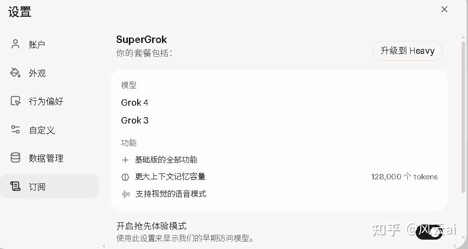
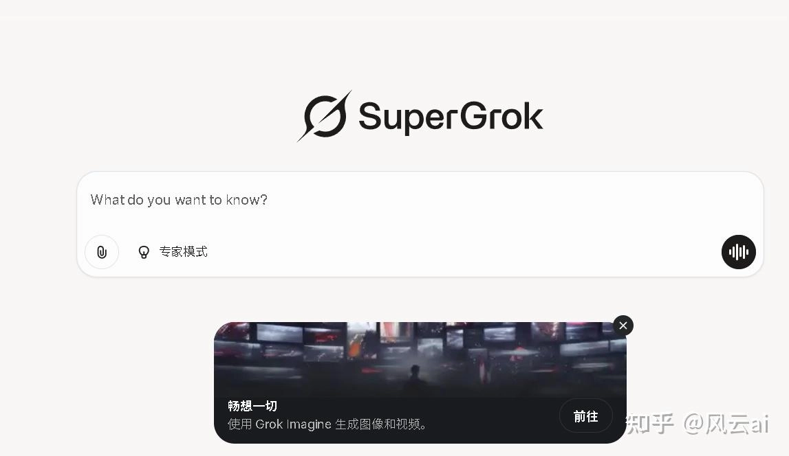

# 怎么订阅SuperGrok？三个方法帮你搞定，第一个最省心

---

最近想升级Grok的高级版SuperGrok，结果被支付问题卡住了——免费版用着用着就提示次数用完，正聊得起劲突然断了，那感觉真的很难受。作为一个AI工具爱好者，我花了一晚上研究怎么在国内订阅SuperGrok，试了几种方法后，终于找到了最适合普通人的解决方案。下面我把实际操作过程分享出来，从最简单到稍微需要动手的，都有涉及。

---

## 方法一：用代充平台，五分钟搞定

如果你和我一样，没有国外信用卡，也不想折腾，代充平台是最直接的选择。

我当时在知乎看到有人推荐404141.xyz这个网站，说是自助下单，支持支付宝付款。一开始我也担心靠不靠谱，但想着试试也不亏，就打开看了看。网站界面挺清楚的，直接有SuperGrok的订阅选项，旁边还有ChatGPT Plus等其他AI服务的充值入口。

操作起来很简单：选择"SuperGrok订阅代充"，填写你的Grok账户邮箱，然后选支付宝付款。我付完款后等了几分钟，再登录Grok网站，发现已经升级成会员了。整个过程没有卡顿，也没遇到什么问题。

这种方法最大的好处就是省心。你不用研究信用卡怎么办，不用担心支付失败，也不用自己去国外网站填各种信息。对于只想快速用上SuperGrok的人来说，这个方法最实在。当然，选代充平台的时候要看清楚评价，我这次用下来感觉还不错，至少比自己瞎折腾轻松多了。

如果你正在为支付发愁，不妨考虑👉 [直接通过代充平台订阅Grok Super会员一个月成品号（质保30天）](https://shaoyumi.com/buy/66)，省去各种繁琐步骤。

## 方法二：苹果用户可以试试App内购

如果你用iPhone或iPad，可以直接在Grok的iOS应用里订阅。打开美区App Store下载Grok应用，登录账号后，在设置或会员页面找到"Upgrade to SuperGrok"的按钮，用苹果礼品卡完成支付就行了。

这个方法对苹果用户来说比较直接，但有个问题——不是所有地区都能顺利内购，有时候会遇到支付失败的情况。另外，通过苹果订阅的话，价格可能会比官网贵一点（因为苹果会抽成）。如果你决定用这个方法，记得去苹果账户管理里关掉自动续订，不然每个月都会自动扣费。

## 方法三：申请虚拟信用卡自己订阅

这个方法适合喜欢自己动手的人。简单说就是先办一张虚拟的国际信用卡，然后用它在Grok官网订阅SuperGrok。

我试过这个流程，确实能用，但过程稍微复杂一点。你需要先在提供虚拟卡服务的平台（比如之前有人推荐的WildCard，不过据说最近状况不太稳定）注册账号，申请一张虚拟Master卡或Visa卡。拿到卡号后，通过支付宝给卡里充30美元（SuperGrok月费刚好是30美元）。

充值完成后，打开Grok官网，登录账号，找到"Go Super"或"Upgrade to SuperGrok"的选项，输入虚拟卡的卡号、有效期和CVV码，确认支付就行了。如果一切顺利，你的账号会立刻升级成SuperGrok会员。

这个方法的好处是费用透明，就是30美元本身，没有额外收费。但缺点也明显：你需要能访问Grok官网，还要花时间研究虚拟卡平台哪个靠谱。而且有些虚拟卡平台最近出过状况，选的时候要多看看最新评价。

还有一点很重要：订阅成功后记得去Grok官网的设置里关掉自动续费，不然下个月会自动从你卡里扣钱。我就是订完后立刻去把自动续订关了，省得下个月忘记又被扣款。

---

## 三种方法怎么选？

从我的实际体验来看：

- **想省事**，就用代充平台，几分钟搞定，不用自己研究各种支付工具
- **有苹果设备**，可以试试App内购，但要做好可能无法购买的心理准备
- **喜欢折腾**，虚拟信用卡是个选择，成功后有成就感，但过程比较费时间

我最后选了第一种方法，因为实在不想花时间研究信用卡。对于大部分人来说，能快速用上SuperGrok才是最重要的，至于用什么方式付款，其实没那么重要。如果你也被支付问题困扰，不妨👉 [试试代充平台的Grok Super会员一个月成品号（质保30天）](https://shaoyumi.com/buy/66)，直接跳过所有麻烦环节。

---

升级SuperGrok后，最明显的变化就是对话次数不受限了，图片生成也能随便用，不用再扣着次数小心翼翼地问问题。如果你经常用Grok，升级成SuperGrok确实值得。希望这篇分享能帮到和我一样卡在支付环节的朋友，有问题随时交流。
